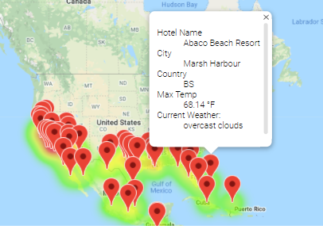

# World Weather Analysis
## Overview

We have joined the development for a new website, PlanMyTrip. The first project we have been assigned is to help find a way to help users of the website find their ideal hotel based the users desires.
 
We will collect and analyze weather data across cities worldwide. When the end user enters their desires into the website, PlanMyTrip will use the weather data that was collected to suggest ideal hotels.

The weather data will be gathered from public data provided by OpenWeatherAPI. The data will consist of the following:

- City name
- Country
- Today's date
- Latitude of the city 
- longitude of the city
- Maximum temperature for today
- Humidity
- Cloudiness
- Wind speed

Once the end user provides their weather requirements, the system will look into the weather data we have, and then find a hotel in those areas with appropriate weather. The town identified in the weather data will then be sent to the Google Map APIs and a hotel in the area will be identified.

## Weather Data

The weather data for random cities around the world was gathered and consolidated into a data set to be utilized by PlanMyTrip. An example of of the data found in the data set looks like the following: 

## Usage of Weather Data

The PlanMyTrip website asks the end user to enter a minimum and a maximum temperature for the destination they are searching the website for. After entering these values, the system will search the weather data for cities with maximum temperatures in the range defined by the end user.

If the end user enters a minimum temperature of 55 and a maximum of 77 they get a sample of weather data that looks like this:

 This new selected list of cities is then passed off to the Google Map API which searches for things nearby the city. We setup the search to find a hotel in each of the end users selected cities.

After the list of hotels are produced, a map is built utilizing Google's Map API. On this map the selected cities are mapped, and on each city a marker is built to show the end user the weather data about the ciy and the hotel we found. An example of looks like the following:

